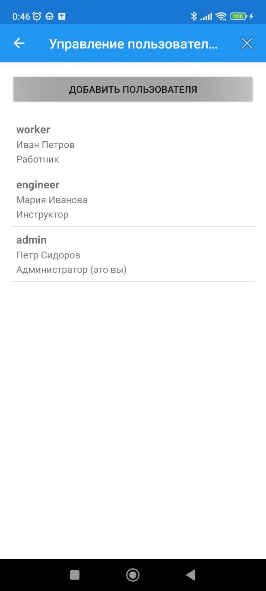
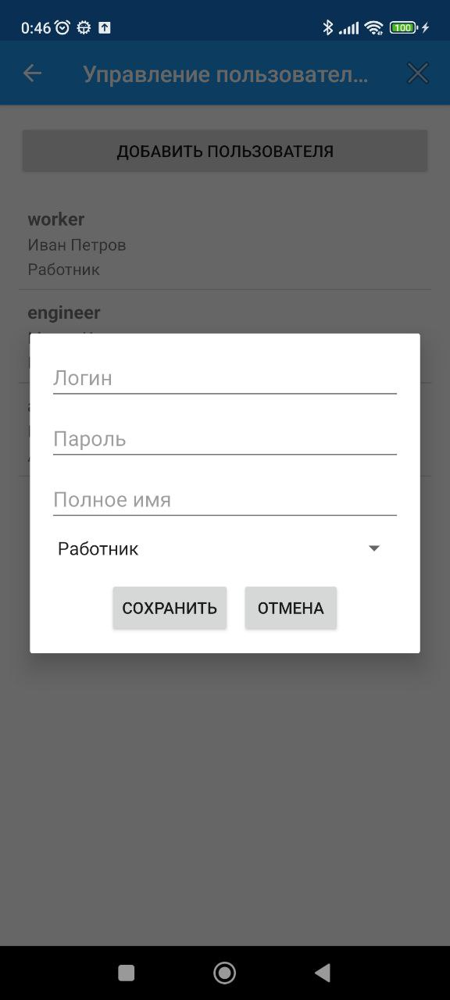
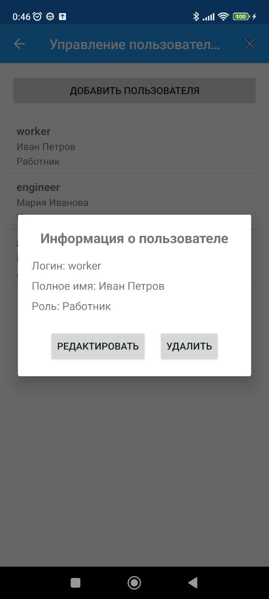

# Охрана труда: Система управления инструктажами и тестированием

**Руководство пользователя**
*Версия 1.0*

---

## Содержание

1. [Введение](#введение)
2. [Начало работы и вход в систему](#начало-работы-и-вход-в-систему)
3. [Роли пользователей и доступные функции](#роли-пользователей-и-доступные-функции)
4. [Рабочее место работника](#рабочее-место-работника)
    * [4.1 Обучение (инструктажи)](#41-обучение-инструктажи)
    * [4.2 Тестирование](#42-тестирование)
    * [4.3 Просмотр результатов теста](#43-просмотр-результатов-теста)
5. [Рабочее место инструктора](#рабочее-место-инструктора)
    * [5.1 Создание инструктажей](#51-создание-инструктажей)
    * [5.2 Назначение инструктажей](#52-назначение-инструктажей)
    * [5.3 Контроль инструктажей](#53-контроль-инструктажей)
    * [5.4 Анализ тестов](#54-анализ-тестов)
    * [5.5 Просмотр отчета](#55-просмотр-отчета)
6. [Рабочее место администратора](#рабочее-место-администратора)
    * [6.1 Управление пользователями](#61-управление-пользователями)
    * [6.2 Обслуживание системы](#62-обслуживание-системы)
7. [Выход из системы](#выход-из-системы)

---

## Введение

**«Охрана труда»** – это мобильное приложение, разработанное для автоматизации процессов обучения, проверки знаний и контроля соблюдения требований охраны труда на предприятии. Система позволяет разграничить права доступа для сотрудников (работников), инженеров по охране труда (инструкторов) и администраторов, обеспечивая централизованное управление инструктажами и тестированием.

### Основные возможности

- **Многопользовательский режим** – поддержка трех ролей: Работник, Инструктор, Администратор.
- **Управление инструктажами** – создание, назначение, контроль прохождения.
- **Модуль тестирования** – прохождение тестов с автоматической проверкой и сохранением результатов.
- **Аналитика и отчеты** – просмотр статистики по тестам и общей сводки по системе.
- **Управление пользователями** – добавление, редактирование и удаление учетных записей.

---

## Начало работы и вход в систему

Для начала работы вам необходимо войти в приложение, используя свои учетные данные.

### Как войти в систему

1.  Запустите приложение на вашем устройстве.
2.  На экране авторизации введите:
    *   **Логин** – ваше уникальное имя пользователя.
    *   **Пароль** – ваш пароль.
3.  Нажмите кнопку **«Войти»**.

  
  
<em>Экран авторизации</em>

Если вы забыли свои данные, обратитесь к администратору системы. При успешном входе вы будете автоматически перенаправлены в раздел, соответствующий вашей роли (работник, инструктор или администратор).

---

## Роли пользователей и доступные функции

В приложении реализовано три уровня доступа. От того, какая роль назначена пользователю, зависит набор доступных функций.

*   **Работник**: Проходит назначенные инструктажи и тесты, отслеживает свой прогресс.
*   **Инструктор (Инженер)**: Создает учебные материалы (инструктажи), назначает их сотрудникам, контролирует выполнение, анализирует результаты тестов и просматривает общую статистику.
*   **Администратор**: Управляет пользователями системы (добавление, редактирование, удаление) и выполняет техническое обслуживание.

---

## Рабочее место работника

После входа под учетной записью работника открывается главный экран с двумя вкладками: **«Обучение»** и **«Тесты»**.

  
  
<em>Экран работника с нижней навигацией</em>

### 4.1 Обучение (инструктажи)

В этом разделе отображается список инструктажей, назначенных вам.

1.  **Просмотр списка**: Вы увидите перечень инструктажей с указанием статуса («Назначено» или «Пройдено») и срока выполнения.
2.  **Детали инструктажа**: Нажмите на любой инструктаж в списке, чтобы открыть его подробное описание.
3.  **Изучение и отметка**: Внимательно изучите содержание инструктажа. Если вы усвоили материал, нажмите кнопку **«Отметить как пройденный»** внизу экрана.

  
  
<em>Детальный просмотр и отметка о прохождении инструктажа</em>

> **Важно:** После отметки «Пройдено» изменить статус будет нельзя. Кнопка для сдачи станет неактивной.

### 4.2 Тестирование

В этом разделе вы можете проверить свои знания, пройдя доступные тесты.

1.  **Список тестов**: На вкладке «Тесты» отображаются все доступные для прохождения тесты.
2.  **Начало теста**: Нажмите на интересующий вас тест. Вы перейдете к первому вопросу.
3.  **Прохождение теста**:
    *   В верхней части экрана указан прогресс (например, "Вопрос 1 из 5").
    *   Внимательно прочитайте вопрос и выберите один из трех вариантов ответа.
    *   После выбора нажмите кнопку **«Далее»**.

  
  
<em>Выбор теста и экран с вопросом</em>

### 4.3 Просмотр результатов теста

После ответа на последний вопрос тест автоматически завершится, и вы увидите экран с результатами.

На этом экране отображается:

*   **Общий результат**: Количество правильных ответов и процент успеха (например, "Результат: 4 из 5 (80%)").
*   **Детальный разбор**: Под общим результатом находится список всех вопросов, где показано:
    *   Текст вопроса.
    *   **Ваш ответ** (зеленый цвет – ответ верный, красный – неверный).
    *   **Правильный ответ** (для вопросов, где вы ошиблись).

  
  
<em>Экран с детальными результатами теста</em>

Чтобы завершить просмотр, нажмите кнопку **«Завершить»**.

---

## Рабочее место инструктора

Инструктору доступен более широкий функционал для управления процессом обучения.

  
  
<em>Главное меню инструктора</em>

### 5.1 Создание инструктажей

1.  На главном экране нажмите **«Создание инструктажей»**.
2.  Заполните все поля:
    *   **Название инструктажа**.
    *   **Срок выполнения** в формате `ДД-ММ-ГГГГ`.
    *   **Текст инструктажа** – подробное описание материала.
3.  Нажмите кнопку **«Сохранить»**.

  
  
<em>Форма создания нового инструктажа</em>

> Приложение автоматически проверяет корректность формата даты и то, что срок не указан в прошлом.

### 5.2 Назначение инструктажей

1.  Нажмите **«Назначение инструктажей»**.
2.  Выберите получателя:
    *   **Конкретному сотруднику** – выберите ФИО из списка.
    *   **Всем сотрудникам** – назначение будет выполнено для всех работников сразу.
3.  Выберите **инструктаж** из списка.
4.  Поле **«Срок выполнения»** заполнится автоматически на основе данных, указанных при создании инструктажа.
5.  Нажмите **«Назначить»**.

  
  
<em>Форма назначения инструктажа сотрудникам</em>

### 5.3 Контроль инструктажей

Этот раздел позволяет отслеживать процесс прохождения назначенных инструктажей.

1.  Нажмите **«Контроль инструктажей»**.
2.  Вы увидите список всех назначений с информацией о сотруднике, названии инструктажа, статусе («Назначено»/«Пройдено») и сроке.
3.  **Отметка о прохождении**: Если статус инструктажа «Назначено», вы можете отметить его как пройденный вручную (например, если сотрудник сообщил об этом устно). Для этого нажмите на запись в списке и подтвердите действие в появившемся диалоговом окне.

  
  
<em>Список инструктажей для контроля и подтверждение отметки</em>

### 5.4 Анализ тестов

В этом разделе отображается сводная информация по всем попыткам прохождения тестов. Вы можете увидеть, кто из сотрудников, какой тест проходил, и какой результат получил.

  
  
<em>Список результатов тестирования</em>

### 5.5 Просмотр отчета

Раздел предоставляет общую статистику по системе, включая:

*   Общее количество сотрудников.
*   Количество назначенных и пройденных инструктажей.
*   Средний балл по всем тестам.

  
  
<em>Экран со сводным отчетом</em>

---

## Рабочее место администратора

Администратор отвечает за управление учетными записями и техническое обслуживание приложения.

  
  
<em>Главное меню администратора</em>

### 6.1 Управление пользователями

В этом разделе администратор может создавать, редактировать и удалять учетные записи пользователей.

1.  Нажмите **«Управление пользователями»**.
2.  **Добавление пользователя**: Нажмите кнопку **«Добавить пользователя»** и заполните форму:
    *   Логин, пароль, полное имя.
    *   Выберите роль из списка (Работник, Инструктор, Администратор).
    *   Нажмите **«Сохранить»**.

  
  
<em>Список пользователей и форма добавления нового</em>

3.  **Редактирование и удаление**: Нажмите на любого пользователя в списке. Откроется диалог с информацией.
    *   Для изменения данных нажмите **«Редактировать»**.
    *   Для удаления аккаунта нажмите **«Удалить»** и подтвердите действие.

> **Важно:** Администратор не может редактировать или удалять свою собственную учетную запись.

  
  
<em>Диалог с информацией и кнопками редактирования/удаления</em>

